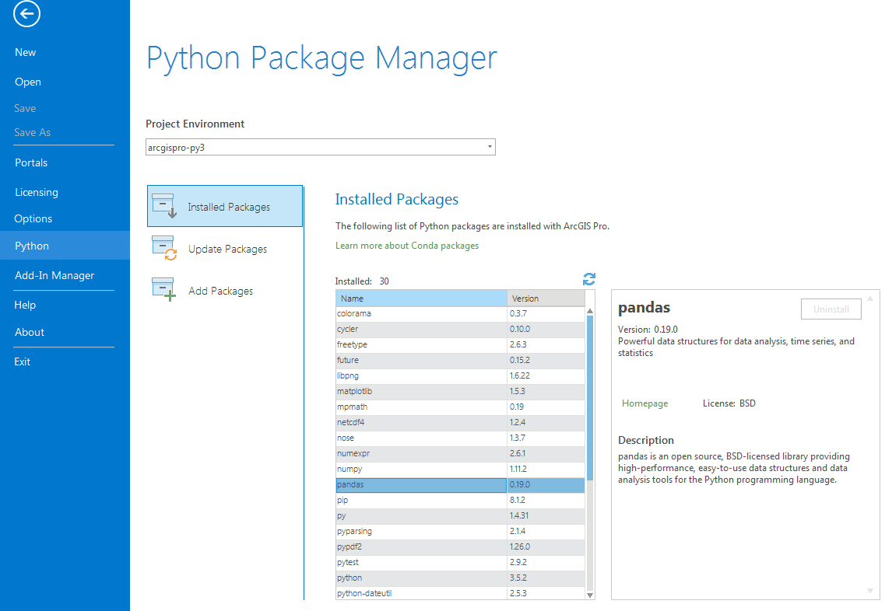

% Harnessing the Power of Python in ArcGIS Using the Conda Distribution
% Shaun Walbridge; Clinton Dow

<section data-background="images/title.png">
<div id="links">
<h2>[https://github.com/scw/conda-devsummit-2017-talk](https://github.com/scw/conda-devsummit-2017-talk)</h2>
<h3>[High Quality PDF](https://4326.us/esri/conda-2017/devsummit-2017-conda-arcgis-presentation-full.pdf)</h3>
</div>
</section>

Conda {data-background="images/Picture5.jpg"}
=====

Getting to Packages {data-background="images/Picture5.jpg"}
-------------------

{class="tight"}

Why Packages? {data-background="images/Picture5.jpg"}
-------------

 - Software is composed of many smaller components, often called _packages_ or _libraries_.
 - It's often better to reuse code that solves a problem well rather than recreating it
 - But, sharing code is a **hard problem**. Do you have the same packages of the same versions 
   as the developer did?

Package Management for Python {data-background="images/Picture5.jpg"}
-----------------------------

Why not ``pip``, wheels, virtualenvs?

 - Don't handle the harder problem of system dependencies, considered out of scope by Python packagers -- does it end up in ``site-packages``?
  - Package devs: On OSX and Linux, 'easy' to get the deps! Use a system package manager (e.g. ``apt``, ``brew``, ``yum``) and the included compiler (e.g. ``clang``, ``gcc``).
   - It's still not easy to make reproducible builds, and what about _that other_ platform?

Why Conda? {data-background="images/Picture5.jpg"}
----------
{style="width: 200px; background-color: rgba(255, 255, 255, 1);"}

* Scientific Python community identified that there was a gap not being addressed by the core Python infrastructure, limiting their ability to get packages into the hands of users

* Industry standard built by people who care about this space &mdash; _Continuum Analytics_

{style="width: 200px; background-color: rgba(255, 255, 255, 1);"}

Why Conda? {data-background="images/Picture5.jpg"}
----------

{style="width: 200px; background-color: rgba(255, 255, 255, 1);"}

* It solves the hard problem:

    - Handles dependencies for many languages
    - Built for Python first, but it really solves a much broader infrastructural issue.
* Gateway to data science &mdash; scientific, analytics, integrated software ecosystem for organizations

Interlude: _Reviewing Reviews_ {data-background="images/Picture2.jpg"}
==============================

Reviewing Reviews {data-background="images/Picture2.jpg"}
-----------------


Reviewing Reviews {data-background="images/Picture2.jpg"}
-----------------

<div class="sourceCode"><pre class="sourceCode python"><code class="sourceCode python">score <span class="op">=</span> (ratings.<span class="bu">sum</span>(axis<span class="op">=</span><span class="dv">1</span>) <span class="op">+</span> inverse_ratings.<span class="bu">sum</span>(axis<span class="op">=</span><span class="dv">1</span>)<span class="op">*</span><span class="dv">5</span>)
<span class="co">"""</span>
<span class="co">1041    30.0     1034    30.0     1036    29.0</span>
<span class="co">1039    27.0     1038    26.0     1037    26.0</span>
<span class="co">1040    25.0     1042    24.0     1035    <b>15.0</b></span>
<span class="co">"""</span>
<span class="co"># 1035, let's see if they left us a comment</span>
df_conda.loc[<span class="dv">1035</span>][<span class="st">'Comments'</span>]</code></pre></div>

<div class="notes">
```python
score = (ratings.sum(axis=1) + inverse_ratings.sum(axis=1)*5)
"""
1041    30.0     1034    30.0
1036    29.0     1039    27.0
1038    26.0     1037    26.0
1040    25.0     1042    24.0
1035    15.0
"""
# 1035, let's see if they left us a comment
df_conda.loc[1035]['Comments']
```
</div>

. . .

> There was no real basic explanation of what conda does...  just a package and env manager.

Reviewing Reviews {data-background="images/Picture2.jpg"}
-----------------

> If you don't agree with someone, try walking a mile in their shoes...

. . .

> ...because then you'll be a mile away from them, and you'll have their shoes.
> &mdash; Terry Pratchett
<div class="notes">
PODIUM -> Cactus to Clouds trail
</div>

<span style="display:none">.</span>
----------------------------

<iframe width="1300" height="650" frameborder="0" scrolling="no" marginheight="0" marginwidth="0" title="Walk a mile" src="https://angp.maps.arcgis.com/apps/presentation/index.html?webmap=7cd22525f46a4b88ac40417bac9fc715"></iframe>

<div class="notes">
Easily retreat up into the mountains provided we have enough water, ... ha ha

https://angp.maps.arcgis.com/apps/presentation/index.html?webmap=7cd22525f46a4b88ac40417bac9fc715
</div>

Fundamentals {data-background="images/Picture3.jpg"}
============

Fundamentals {data-background="images/Picture3.jpg"}
------------

 - Consistent building of packages (Windows, Linux, Mac OS), public and private sharing
 - Cross platform, and _cross-langauge_ &mdash; handles _C/C++_, _R_, _Java_, _Scala_, _Javascript_ and many more
 - Ultimately realized as a collection of files in an archive, and rules which dictate package dependencies
 - Open source: Esri is using it, you can use it in your own projects for other contexts
 
<span style="display:none">.</span> {class="tight"} {data-background="images/Picture3.jpg"}
--------------

 + _Environments_ &mdash; 
    - A collection of packages and Python install is called an *environment*, the building block for managing Python with Conda
    - Flexibly make changes without affecting installed software
    - Can create multiple environments and switch seamlessly
 + _Requirements_ &mdash; include explicit state information, not just the package name.

Where do I get packages? {data-background="images/Picture3.jpg"}
------------------------

 + Conda packages can come from a variety of locations:
    - Public repositories hosted on [Anaconda Cloud](https://anaconda.org)
    - Public repositories self-hosted
    - Private repositories
    - [Anaconda Enterprise](https://www.continuum.io/anaconda-subscriptions)
    - On disk<br>
 + _Channels_ &mdash;
    - A collection of packages owned by a user or organization
    - Configure Conda to look at these locations (`.condarc` file)

Demo: Using Packages {data-background="images/Picture5.jpg"}
--------------------

Conda Basics {data-background="images/Picture3.jpg"}
------------

Activating environments, a couple ways:

 * Use the shortcuts included in Pro
 * Manually activate the environment:

```sh
    cd C:\ArcGIS\bin\Python\Scripts
    activate arcgispro-py3
```

Conda Basics {data-background="images/Picture3.jpg"}
------------

    conda --help

    conda info

Conda info is the starting point &mdash; it tells you the state of the environment.

Conda Basics {data-background="images/Picture3.jpg"}
------------

    conda list

    # packages in environment at C:\ArcGIS\bin\Python\envs\arcgispro-py3:
    #
    colorama                  0.3.7                    py35_0    defaults
    cycler                    0.10.0                   py35_0    defaults
    future                    0.15.2                   py35_0    defaults
    matplotlib                1.5.3              np111py35_0e  [arcgispro]  esri
    mpmath                    0.19                     py35_1    defaults
    netcdf4                   1.2.4                   py35_0e  [arcgispro]  esri
    nose                      1.3.7                    py35_1    defaults
    numexpr                   2.6.1              np111py35_0e  [arcgispro]  esri
    numpy                     1.11.2                  py35_0e  [arcgispro]  esri
    pandas                    0.19.0              np111py35_0    defaults
    pip                       8.1.2                    py35_0    defaults
    py                        1.4.31                   py35_0    defaults
    pyparsing                 2.1.4                    py35_0    defaults
    pypdf2                    1.26.0                     py_0    esri
    pytest                    2.9.2                    py35_0    defaults
    python                    3.5.2                         0    defaults
    python-dateutil           2.5.3                    py35_0    defaults
    pytz                      2016.6.1                 py35_0    defaults
    requests                  2.11.1                   py35_0    defaults
    scipy                     0.18.1             np111py35_0e  [arcgispro]  esri
    setuptools                27.2.0                   py35_1    defaults
    sympy                     1.0                      py35_0    defaults
    wheel                     0.29.0                   py35_0    defaults
    xlrd                      1.0.0                    py35_0    defaults
    xlwt                      1.1.2                    py35_0    defaults


Deeper Dive {data-background="images/Picture5.jpg"}
===========

Conda Packaging {data-background="images/Picture5.jpg"}
---------------

 - OK, so how do we make a new package?
 - [Create a recipe](https://conda.io/docs/building/recipe.html) which describes the instructions to build the software
    + Where do I get the code?
    + What are we building, and what does it depend on?
    + Run `conda build` to create a package from this recipe

conda packaging {data-background="images/Picture5.jpg"}
---------------

`meta.yaml`

```yaml
package:
  name: conda-devsummit-2017-talk
  version: "1.0"

source:
  git_url: https://github.com/scw/conda-devsummit-2017-talk.git

requirements:
  run:
    - python
    - scikit-learn
```

conda packaging {data-background="images/Picture5.jpg"}
---------------

Build the package:

    conda build c:\example\mypackage

Upload and share:

    anaconda upload mypackage

Demo: Conda Packaging {data-background="images/Picture5.jpg"}
---------------------


Python Package Manager {data-background="images/Picture5.jpg"}
----------------------




How can I use this? {data-background="images/Picture5.jpg"}
-------------------

* We already ship you the SciPy stack &mdash; powerful and out of the box in all products
* Conda command and a Conda root Python install
* New modules (e.g. ``requests``), environment with Pro
* Python Package Manager in Pro

. . .

* Get packages, expand your possibility space
* Package your work: this is an opportunity to distribute it

Where Can I Run This? {data-background="images/Picture5.jpg"}
---------------------

{class="tight" style="padding: 5px"}

 * ArcGIS Pro 1.3
    - Conda is _the_ Python install, included for all
 * ArcGIS Pro 1.4
    - Python Package Manager
    - Python 3.5 with current package set
 * ArcGIS Enterprise 10.5
 * ArcGIS API for Python

from future import * {data-background="images/Picture5.jpg"}
--------------------

 - ArcGIS Pro 2.0:
    - Manage environments and channels
    - Resettable environment
    - "μConda"

Resources {data-background="images/Picture2.jpg"}
=========

Other Sessions {data-background="images/Picture5.jpg"}
--------------

 + [Getting Data Science with R and ArcGIS](https://devsummitps17.schedule.esri.com/session-catalog/1910638256)
    - Weds 4:00PM, San Jacinto
 + [Deploying Your Geoprocessing Tools as Python Modules](https://devsummitps17.schedule.esri.com/session-catalog/1035861570)
    - Weds 4:00, Demo Theater 1
 + [Python Package Management Using Conda](https://devsummitps17.schedule.esri.com/session-catalog/312840303)
    - Weds 4:30PM, Demo Theater 1
 + [Continuum Analytics: Exploring Continuum Analytics’ Open-Source Offerings](https://devsummitps17.schedule.esri.com/session-catalog/216814585)
    - Thurs 10:30AM, Mesquite G-H

Conda vs... {data-background="images/Picture5.jpg"}
-----------

Name | Means | Included?
-|-|-
[Conda](https://conda.io/docs/) | The command itself | ✓
[Miniconda](https://conda.io/miniconda.html) | A minimum set of Python packages to build and run Conda. | ✓
[Anaconda](https://www.continuum.io/anaconda-overview) | A distribution 200+ packages and run Conda | &nbsp;
[Anaconda <br>Workgroup](https://www.continuum.io/anaconda-subscriptions/anaconda-workgroup) | Self-hosted, distributed and HPC additions | &nbsp;


Resources {data-background="images/Picture2.jpg"}
---------

 - [Conda Cheatsheet](http://conda.pydata.org/docs/_downloads/conda-cheatsheet.pdf)
 - [Anaconda.org](https://anaconda.org)
 - [Conda Recipes](https://github.com/conda/conda-recipes)
 - [Harnessing the Power of Python in ArcGIS Using the Conda Distribution](http://www.esri.com/videos/watch?videoid=5072&channelid=LegacyVideo&isLegacy=true)
 - [Understanding Conda by Jake Vanderplas](https://jakevdp.github.io/blog/2016/08/25/conda-myths-and-misconceptions/)
 - [Security updates for Python depdendencies](https://pyup.io)

Closing {data-background="images/Picture2.jpg"}
=======

Thanks {data-background="images/Picture2.jpg"}
------

Esri Conda Team:

{class="tight" style="width:600px"}

Continuum Analytics for creating and open sourcing Conda

Rate This Session {data-background="images/Picture2.jpg"}
-----------------

iOS, Android: Feedback from within the app

. . .

 Be warned that we may incorporate feedback into next year's session

<span style="display: none">.</span> {data-background="images/end.png"}
---
